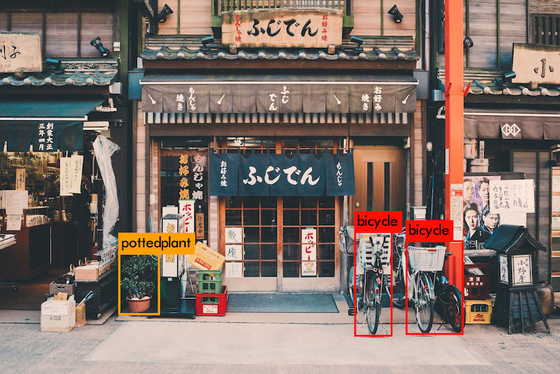

# YOLOv3 Object Detection with Darknet


A convenient way to do object detection using YOLOv3 model via Docker.

## Usage

Run object detection on an image
```bash
docker run --volume ${PWD}/output:/output \
           --interactive --rm tancnle/darknet-yolo < interesting.png
```

View the image with polygon-bounding boxes
```bash
open output/prediction.png
```

## Example Output

  

```bash
Loading weights from yolov3.weights...Done!
/tmp/image: Predicted in 19.697341 seconds.
pottedplant: 98%
bicycle: 89%
bicycle: 73%
```

## References
* YOLO: Real-Time Object Detection (https://pjreddie.com/darknet/yolo/)
* Darknet (https://github.com/pjreddie/darknet)
